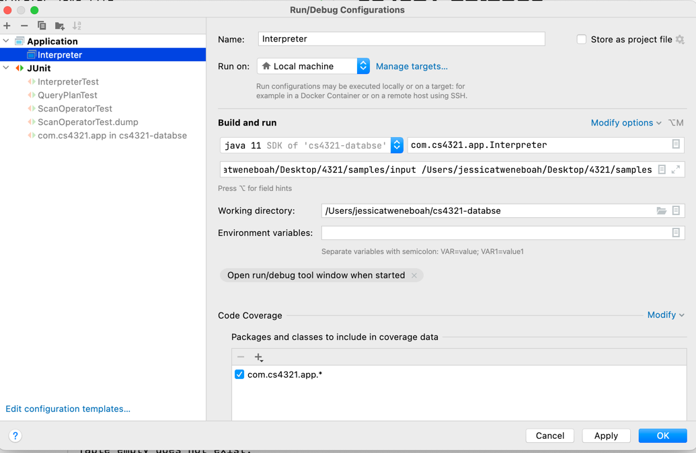

# cs4321-databse

To run/debug a test using an input and output directory:
- Open the Interpreter.java file
- In the IntelliJ IDE select "Edit Configurations" in the top left
- Click on the + sign and select "Application"
- Use the following picture as a template
- In the Parameters field enter the link to you local input and output directories

